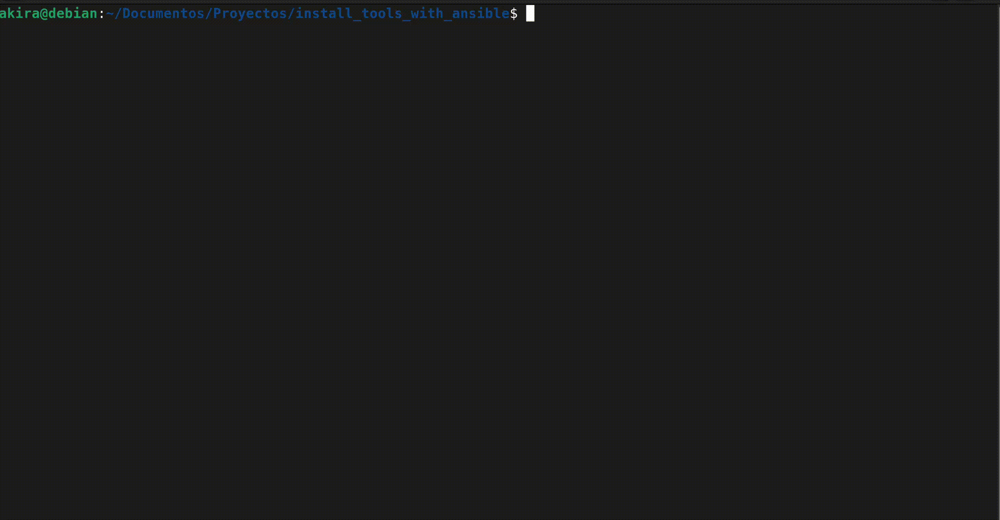

# Install Tools with Ansible


# Requirements
- Python 3.x
- Curl 
- Dialog
- uv

# Tested OS
| Distribution | Tested | Status             |
|-------------|--------|------------------|
| Debian 13 (Trixie)   | ✅      | OK  |

# Tools to Install
- KVM/Qemu
- Docker
- Minikube
- AWS Client
- Terraform
- Vagrant
- Kubectl
- etc


# Use 

### Install packages

```bash
make install
```